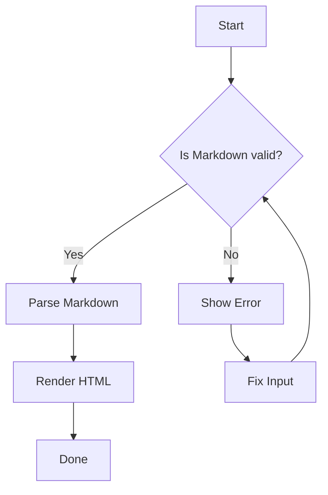
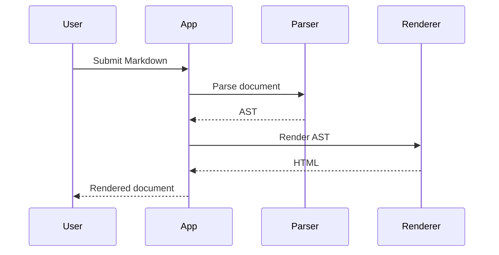
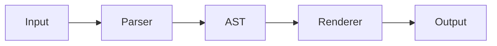

# Markdown Rendering Test

A comprehensive **Markdown rendering stress test**.

---

## 1. Headings

# H1 — Main Heading
## H2 — Section Heading
### H3 — Subsection
#### H4 — Smaller Section
##### H5 — Small Heading
###### H6 — Smallest Heading

---

## 2. Text Formatting

**Bold text**

*Italic text*

***Bold italic text***

~~Strikethrough~~

`Inline code`

<u>Underlined HTML text</u>

==Highlighted text==

**Bold with `inline code` inside**

*Italic with **bold** inside*

---

## 3. Paragraphs

This is a normal paragraph containing some text.

This is another paragraph with a line break.

Markdown renderers should preserve paragraphs correctly and maintain readable spacing between blocks.

Lorem ipsum dolor sit amet, consectetur adipiscing elit. Integer nec odio. Praesent libero. Sed cursus ante dapibus diam.

---

## 4. Links

[OpenAI](https://openai.com)

[GitHub](https://github.com)

<https://example.com>

https://example.com

[Link with title](https://example.com "Example Website")

---

## 5. Unordered Lists

- Item one
- Item two
- Item three
  - Nested item
  - Another nested item
    - Deeply nested item
    - Another deep item

---

## 6. Ordered Lists

1. First item
2. Second item
3. Third item
   1. Nested item
   2. Another nested item
      1. Deep item
      2. Another deep item

---

## 7. Task Lists

- [x] Markdown parser
- [x] Headers
- [x] Tables
- [ ] Mermaid diagrams
- [ ] LaTeX support
- [ ] Footnotes
- [ ] HTML support

---

## 8. Blockquote

> This is a blockquote.

> Blockquotes can contain **bold text**,
> *italic text*, and `inline code`.

> ### Heading inside a blockquote
>
> - List item
> - Another item
>
> > Nested blockquote

---

## 9. Horizontal Rules

---

***

___

---

## 10. Code

Inline code:

`const hello = "world";`

### JavaScript

```javascript
function greet(name) {
    return `Hello, ${name}!`;
}

console.log(greet("Markdown"));
```

### Python

```python
def fibonacci(n):
    if n <= 1:
        return n

    return fibonacci(n - 1) + fibonacci(n - 2)

for i in range(10):
    print(fibonacci(i))
```

### Bash

```bash
#!/usr/bin/env bash

echo "Hello from Bash!"

for file in *.txt; do
    echo "Found: $file"
done
```

### Rust

```rust
fn main() {
    let message = "Hello, Markdown!";
    println!("{message}");
}
```

### JSON

```json
{
  "name": "markdown-test",
  "version": "1.0.0",
  "features": [
    "tables",
    "latex",
    "mermaid"
  ],
  "enabled": true
}
```

### HTML

```html
<!DOCTYPE html>
<html>
  <body>
    <h1>Hello</h1>
  </body>
</html>
```

### CSS

```css
.container {
    display: flex;
    align-items: center;
    justify-content: center;
    padding: 1rem;
}
```

---

## 11. Code Without Language

```text
This is a plain code block.

It should preserve:
    indentation
    spacing
    line breaks

$ echo "hello"
```

---

## 12. Tables

| Feature | Supported | Priority | Notes |
|:--------|:--------:|--------:|:------|
| Headers | ✅ | High | Required |
| Lists | ✅ | High | Nested lists |
| Tables | ✅ | High | Alignment |
| LaTeX | 🟡 | High | Math rendering |
| Mermaid | 🟡 | Medium | Diagrams |
| Footnotes | ❌ | Low | Optional |

### Alignment Test

| Left aligned | Center aligned | Right aligned |
|:-------------|:--------------:|--------------:|
| Apple | Banana | $10 |
| Linux | Windows | $20 |
| Bash | Rust | $30 |

---

## 13. Wide Table

| ID | Name | Language | Framework | Stars | Status | Description |
|---:|------|----------|-----------|------:|--------|-------------|
| 1 | Project Alpha | Rust | Axum | 1200 | Active | Terminal application |
| 2 | Project Beta | TypeScript | React | 850 | Active | Web interface |
| 3 | Project Gamma | Python | FastAPI | 430 | Archived | Experimental API |
| 4 | Project Delta | Bash | None | 92 | Active | CLI utility |
| 5 | Project Epsilon | C | GTK | 210 | Development | Desktop application |

---

# 14. LaTeX / Mathematics

Inline math:

The famous equation is $E = mc^2$.

Another example: $\frac{a}{b} + \frac{c}{d}$.

### Block Math

$$
E = mc^2
$$

### Quadratic Formula

$$
x = \frac{-b \pm \sqrt{b^2 - 4ac}}{2a}
$$

### Summation

$$
\sum_{i=1}^{n} i = \frac{n(n+1)}{2}
$$

### Integral

$$
\int_0^\infty e^{-x^2}\,dx = \frac{\sqrt{\pi}}{2}
$$

### Matrix

$$
A =
\begin{bmatrix}
1 & 2 & 3 \\
4 & 5 & 6 \\
7 & 8 & 9
\end{bmatrix}
$$

### Greek Letters

$$
\alpha + \beta + \gamma + \delta + \epsilon
$$

$$
\theta,\lambda,\mu,\pi,\sigma,\omega
$$

### Set Theory

$$
A \subseteq B,\qquad
A \cup B,\qquad
A \cap B,\qquad
A \setminus B
$$

---

# 15. Mermaid — Flowchart



---

# 16. Mermaid — Sequence Diagram



---

# 17. Nested Everything

> ## Project Status
>
> The project currently supports:
>
> - **Markdown**
> - *LaTeX*
> - `Code`
>
> ```bash
> echo "nested code"
> ```
>
> And some math:
>
> $$
> f(x) = x^2 + 2x + 1
> $$
>
> | Feature | Status |
> |---------|--------|
> | Markdown | ✅ |
> | Math | ✅ |
> | Mermaid | 🟡 |

---

# 18. Special Characters

These characters should render correctly:

`< > & " ' / \ | * _ # + - . ! ? =`

Escaped characters:

\*not italic\*

\_not italic\_

\# not a heading

\[not a link\]

---

# 19. HTML

<div>
  <strong>Bold HTML</strong>
</div>

<details>
<summary>Click to expand</summary>

This content is inside a `<details>` element.

- Item one
- Item two

</details>

<kbd>CTRL</kbd> + <kbd>C</kbd>

<mark>Highlighted HTML text</mark>

---

# 20. Definition List

Term 1
: Definition of term 1

Term 2
: Definition of term 2

---

# 21. Footnotes

Here is a sentence with a footnote.[^1]

Here is another footnote reference.[^note]

[^1]: This is the first footnote.

[^note]: This is a named footnote.

---

# 28. Abbreviations

HTML

*[HTML]: HyperText Markup Language

---

# 21. URLs and Email

https://github.com

https://example.com/test?q=hello&value=123

<test@example.com>

---

# 22. Emoji

😀 😎 🚀 🔥 💻 🐧 ❤️ ⭐ ✅ ❌ ⚠️ 🎉

---

# 23. Very Long Line

This is an intentionally very long line designed to test horizontal overflow and word wrapping behavior in the Markdown renderer. Lorem ipsum dolor sit amet, consectetur adipiscing elit, sed do eiusmod tempor incididunt ut labore et dolore magna aliqua. The renderer should wrap this content naturally without breaking the entire layout or introducing unexpected horizontal scrolling.

---

# 24. Long Code Line

```text
This_is_a_very_long_identifier_that_should_test_horizontal_scrolling_or_wrapping_behavior_in_the_code_block_abcdefghijklmnopqrstuvwxyz_1234567890
```

---

# 25. Empty / Edge Cases

### Empty list

-
- Item

### Consecutive formatting

**bold***italic***bold**`code`~~strike~~

### Numbers

1234567890

### Unicode

こんにちは世界

Привет мир

مرحبا بالعالم

नमस्ते दुनिया

你好世界

---

# 26. Mixed Content Stress Test

## 🚀 Markdown Renderer Test

> **Status:** `Testing`
>
> Everything should render correctly.

### Data

| Test | Result |
|------|--------|
| Markdown | ✅ |
| Code | ✅ |
| Math | ✅ |
| Mermaid | 🟡 |
| HTML | 🟡 |

### Pipeline



### Code

```bash
echo "Markdown rendering test complete!"
```

---

# 37. Final Test

If you can see all of the following correctly, your renderer is doing pretty well:

- **Bold**
- *Italic*
- ~~Strikethrough~~
- `Inline code`
- [Links](https://example.com)
- Lists
- Tables
- Blockquotes
- Syntax-highlighted code
- LaTeX equations
- Mermaid diagrams
- HTML
- Footnotes
- Emoji 😀
- Unicode
- Long text wrapping

---

# 🎉 End of Markdown Test

**Expected result:** Everything above should render cleanly without broken layout, missing elements, or raw syntax leaking into the UI.

